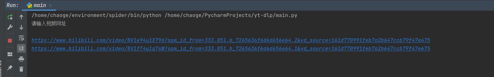
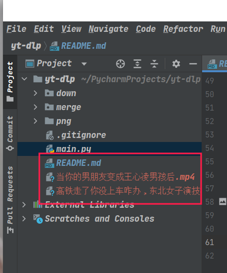

# yt-dlp
一个基于yt-dlp的python程序，在yt-dlp上进行了简单的封装，将不常用的功能封装，只留下一些常用的功能。
(目前仅支持单个文件的爬取)

### 环境准备
建议使用[python官网](https://www.python.org/)3.7版本+[ffmpeg](https://ffmpeg.org/)

### 客户端环境
博主再win和Linux上进行了基本测试mac未经过测试。

###  文件安装
本程序基于yt-dlp

pip install yt-dlp

git clone https://github.com/lcc-666/yt-dlp.git

### IDE
本人使用[pycharm](https://www.jetbrains.com/pycharm/)进行编辑

在main.py中进行基本的配置,由于网络问题,主要用BiliBili做抓取测试。

```python
from down.win import down as win_down1
from down.linux import biliili_down as linux_down
import os

"""
开始文件
"""
if __name__ == '__main__':
    # url:B站视频
    URL=[]
    print("请输入视频网址\n")
    while True:
        Url = input()
        if Url is "":
            break
        else:
            URL.append(Url)

    # Path:存储目录，最好是空的
    Path = ""
    ffmpeg = r"E:\ffmpeg\bin\ffmpeg.exe"
    Type = "mp4"
    detail_inputs = {
        "url": URL,
        "path": Path,
        "ffmpeg": ffmpeg,
        "type": Type
    }

    if os.name is 'nt':
        win_down1(detail_inputs)
    elif os.name is 'posix':
        linux_down(detail_inputs)
```


